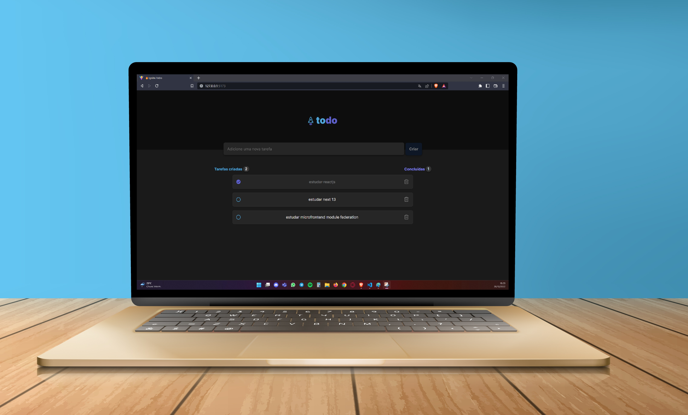

  

    
  

  <h4 align="center">Ignite- ToDo - App de todo para o desafio do ignite.</h4>

## Resumo

<ol>
  <li><a href="#visão-geral-do-projeto">Visão geral do projeto</a></li>
  <li><a href="#tecnologias-utilizadas">Tecnologias utilizadas</a></li>
  <li><a href="#instalação-e-utilização">Instalação e utilização</a></li>
  <li><a href="#conhecimentos-aplicados">Conhecimentos aplicados</a></li>
</ol>

## Visão geral do projeto

    

  <h3>
    <a href="https://ignite-todo-ponqueli.vercel.app/">Ver projeto no Vercel</a>
  </h3>

 

## Tecnologias utilizadas

- [ViteJS](https://vitejs.dev/)
- [ReactJS](https://reactjs.org/)
- [React Hot Toast](https://react-hot-toast.com/)
- [React Hook Form](https://react-hook-form.com/)
- [Phosphor-React Icon](https://phosphoricons.com/)
- [Uuid](https://www.uuidgenerator.net/version4)
- [Vercel](https://vercel.com/)

## Instalação e utilização

### Pré-requisitos

Instalações necessárias

1. NodeJS
2. Npm

### Instalação

1. Baixe as depedências do projeto com o comando `$ npm i`.
2. Rode o projeto com o comando `$ npm run dev`. -> http://127.0.0.1:5173/

## Conhecimentos aplicados

1. Input controlado com React Hook Form
2. Input text com tooltip de erro e focus
3. Mensagens de sucesso ao cadastrar, alterar e deletar tarefa
4. Dados sendo salvos no localStorage do navegador
5. Input checkbox personalizado através de imagem
6. Uso de pseudo-elementos para estilizar o componente de task + input checkbox
7. Padroẽs de código com Prettier e Eslint
8. Utilização de Css Module para cada componente
9. Deploy no vercel
 

<h4 align="center"><a href="#top">Voltar ao Início</a></h4>